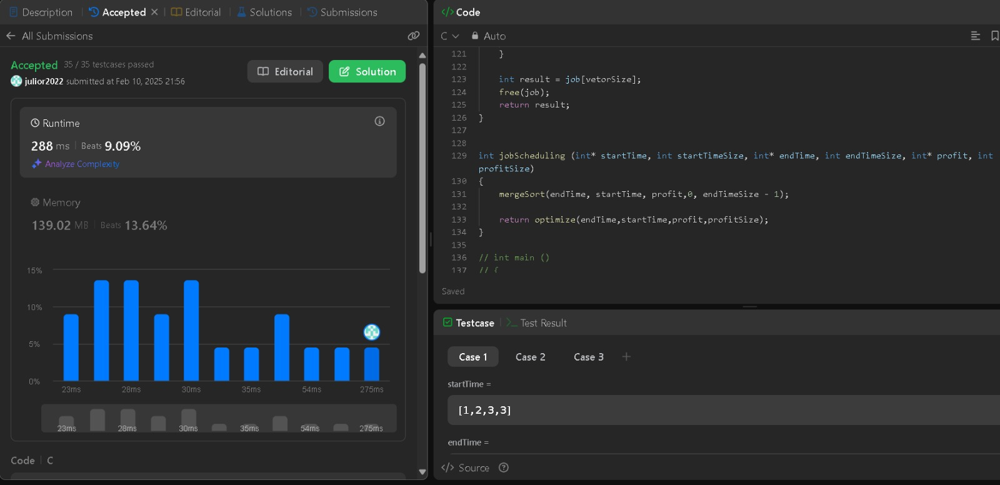
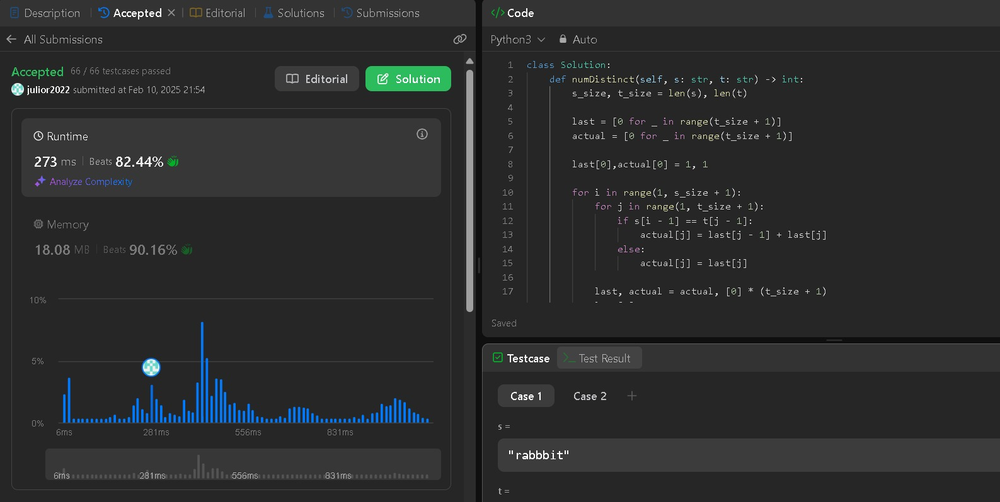

# Exercicios LeetCode

**Número da Lista**: 
**Conteúdo da Disciplina**: Programação Dinâmica 

## Alunos
|Matrícula | Aluno |
| -- | -- |
| 221022041  |  Júlio Roberto da Silva Neto |
| 221021984  |  Guilherme Silva Dutra |

## Sobre 
Resolução de questões disponíveis na plataforma LeetCode, contemplando exercícios de níveis médio e difícil de dificuldade. O objetivo é abordar o conteúdo lecionado em sala de aula de forma simples e intuitiva, com códigos legiveis e de fácil compreensão

## Link da Gravação

## Questões
|Numeração| Exercicio | Dificuldade|
| ---- | ---- | ----- |
|124| [Binary Tree Maximum Path Sum](https://leetcode.com/problems/binary-tree-maximum-path-sum/) | Dificil|
|1235| [Maximum Profit in Job Scheduling](https://leetcode.com/problems/maximum-profit-in-job-scheduling/description/) | Dificil|
|115| [Distinct Subsequences](https://leetcode.com/problems/distinct-subsequences/description/) | DIficil|

## Screenshots
### Binary Tree Maximum Path Sum

### Maximum Profit in Job Scheduling

### Distinct Subsequences

## Instalação 
**Linguagem**: C e Python 

